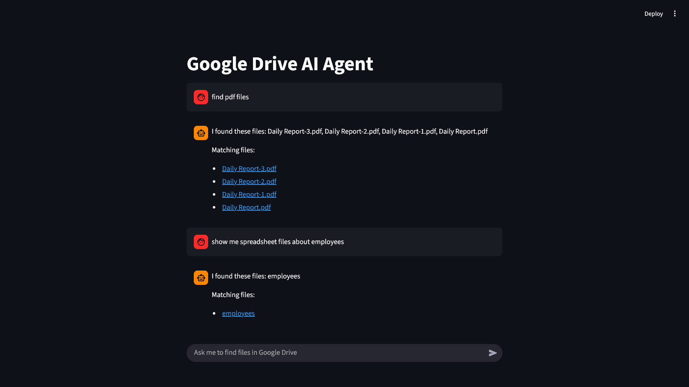
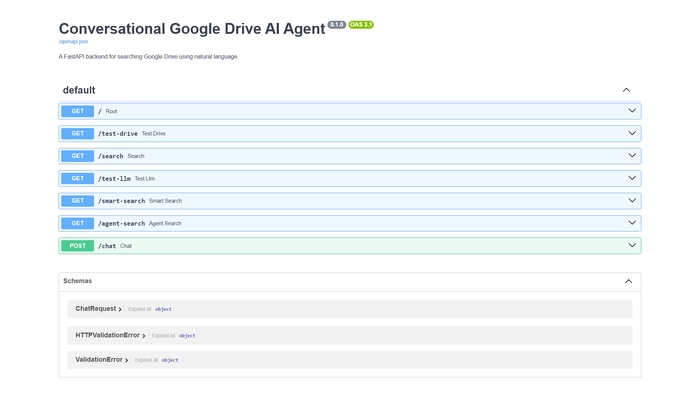
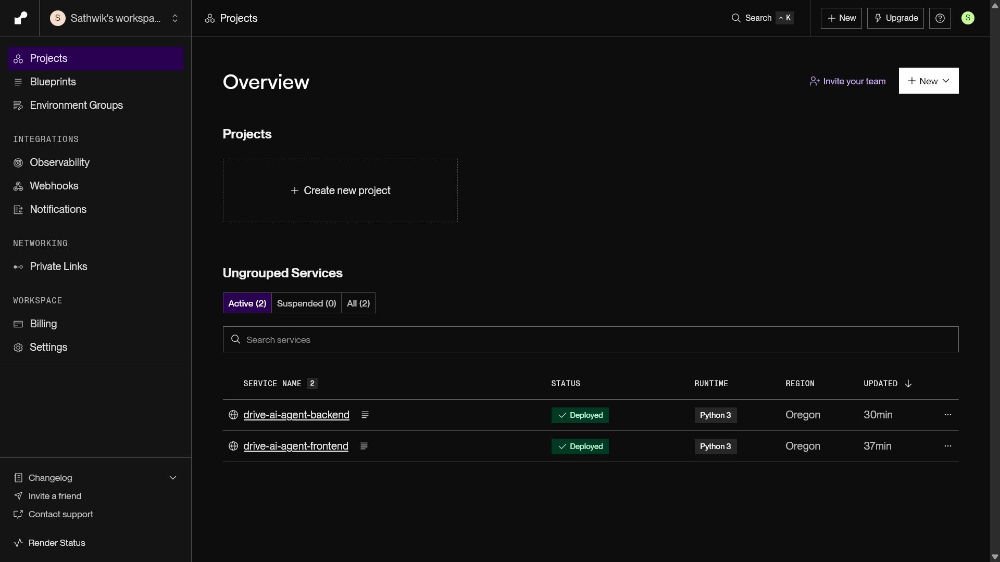

# Conversational Google Drive AI Agent

A conversational AI agent that searches files inside a Google Drive folder using natural language.

The app uses FastAPI for the backend, Streamlit for the frontend, LangChain tool calling for agent behavior, Gemini for LLM reasoning, and Google Drive API `files.list()` with the `q` parameter for accurate file search.

## Features

- Search Google Drive files from chat
- Exact and partial file name search
- File type filtering using MIME types
- Natural language to Google Drive query conversion
- Google Drive `files.list()` search using `q`
- File result links in the chat UI
- Service Account authentication
- Render deployment using `render.yaml`
- Local full-stack run using `docker-compose.yaml`

## Tech Stack

- Python
- FastAPI
- Streamlit
- LangChain
- Gemini API
- Google Drive API
- Render
- Docker Compose

## Project Structure

```text
backend/
  app/
    main.py
    services/
      drive_service.py
      llm_service.py
      query_builder.py
    tools/
      drive_search_tool.py

frontend/
  streamlit_app.py

render.yaml
docker-compose.yaml
requirements.txt
```

## Environment Variables

Create a `.env` file in the project root:

```env
GOOGLE_APPLICATION_CREDENTIALS=credentials.json
GOOGLE_DRIVE_FOLDER_ID=your_google_drive_folder_id
GOOGLE_API_KEY=your_gemini_api_key
GEMINI_MODEL=gemini-2.5-flash
```

For Render deployment, add:

```env
GOOGLE_DRIVE_FOLDER_ID=your_google_drive_folder_id
GOOGLE_API_KEY=your_gemini_api_key
GEMINI_MODEL=gemini-2.5-flash
GOOGLE_SERVICE_ACCOUNT_JSON=full_service_account_json
BACKEND_URL=https://your-backend-url.onrender.com
```

## Google Drive Setup

1. Create a Google Cloud project.
2. Enable Google Drive API.
3. Create a Service Account.
4. Download the service account JSON credentials.
5. Copy the sample Google Drive folder into your own Drive.
6. Share the copied folder with the Service Account email.
7. Add the copied folder ID to `.env`.

## Run Locally

Install dependencies:

```bash
pip install -r requirements.txt
```

Run backend:

```bash
uvicorn backend.app.main:app --reload
```

Run frontend in another terminal:

```bash
streamlit run frontend/streamlit_app.py
```

Backend docs: `http://127.0.0.1:8000/docs`

Frontend: `http://localhost:8501`

## Run With Docker Compose

```bash
docker compose up
```

Frontend: `http://localhost:8501`

Backend: `http://localhost:8000/docs`

## API Endpoints

### Health Check

```
GET /
```

### Test Google Drive

```
GET /test-drive
```

### Basic Name Search

```
GET /search?name=budget
```

### Smart Search

```
GET /smart-search?message=find pdf budget files
```

### Chat

```
POST /chat
```

Request body:

```json
{
  "message": "find pdf budget files"
}
```

## Deployment

This project uses `render.yaml` to deploy two Render web services:

- `drive-ai-agent-backend`
- `drive-ai-agent-frontend`

Backend start command:

```bash
uvicorn backend.app.main:app --host 0.0.0.0 --port $PORT
```

Frontend start command:

```bash
streamlit run frontend/streamlit_app.py --server.port $PORT --server.address 0.0.0.0
```

## Architecture

```
User
  ↓
Streamlit Chat UI
  ↓
FastAPI /chat endpoint
  ↓
Gemini + LangChain Tool Calling
  ↓
Google Drive Search Tool
  ↓
Google Drive API files.list(q=...)
  ↓
Matching file results
```

## Screenshots

### Streamlit Chat UI



### FastAPI Docs



### Render Deployment



## Deployment Links

Backend: `https://drive-ai-agent-backend.onrender.com`

Frontend: `https://drive-ai-agent-frontend.onrender.com`

## Notes

- `.env` and `credentials.json` are ignored by Git.
- The Google Drive folder must be shared with the Service Account email.
- Render free services may take some time to wake up on the first request.
